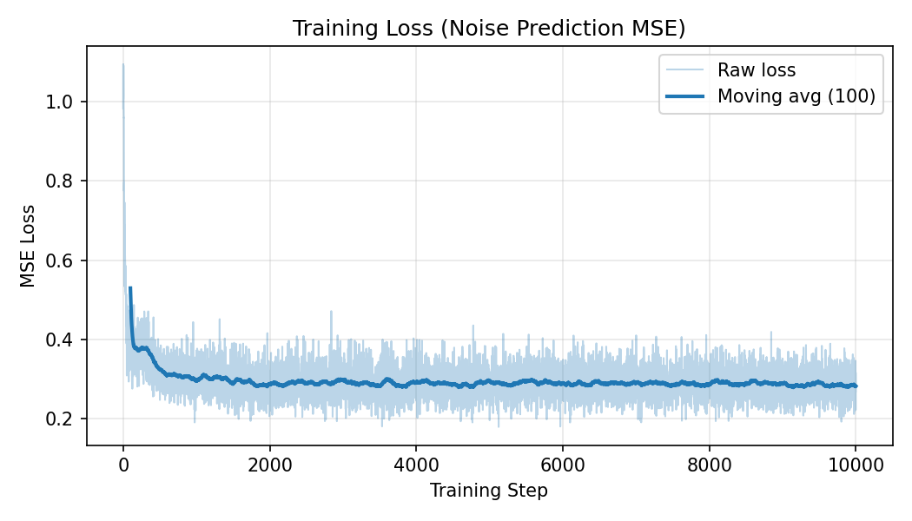
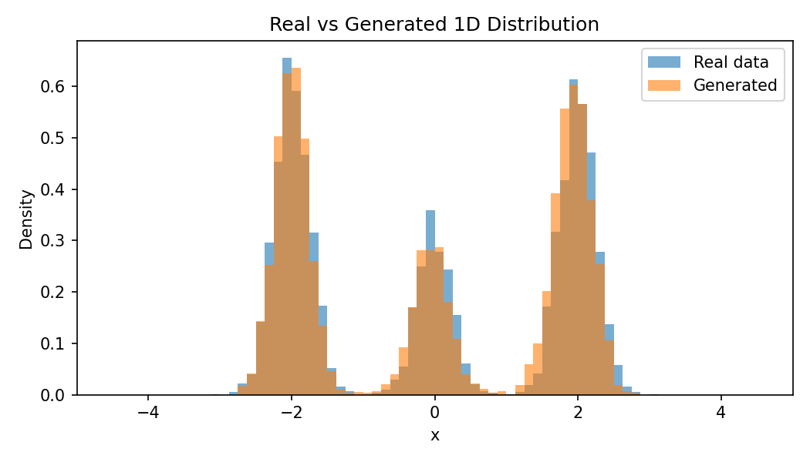
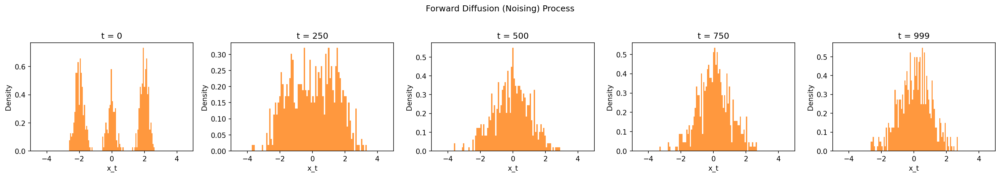

# 1D Denoising Diffusion Probabilistic Model in PyTorch

A minimal PyTorch implementation of a **1D Denoising Diffusion Probabilistic Model (DDPM)** trained on a toy mixture-of-Gaussians distribution.

This project is designed as an educational implementation for understanding the core mechanics of diffusion-based generative modeling, including forward noising, reverse denoising, timestep conditioning, and noise prediction.

---

## Overview

Diffusion models learn to generate data by gradually transforming noise into structured samples.

They work in two main stages:

1. **Forward diffusion:** progressively add Gaussian noise to clean data.
2. **Reverse diffusion:** train a neural network to remove noise step by step and recover data-like samples.

In this project, the model learns a simple 1D distribution with three modes near:

```text
-2, 0, 2
```

After training, the model starts from random Gaussian noise and generates new 1D samples that approximate the original distribution.

---

## What this project demonstrates

This project implements the main DDPM pipeline in a small, readable form:

- Synthetic 1D mixture-of-Gaussians dataset
- Forward diffusion process
- Noise prediction objective
- Sinusoidal timestep embeddings
- MLP-based denoising model
- Reverse diffusion sampling
- Training loss visualization
- Real vs generated distribution comparison
- Forward noising visualization

The goal is not to build a large image-generation model, but to show the core idea behind diffusion models in a simple setting.

---

## Background

In DDPM training, a clean sample \(x_0\) is corrupted with noise at a random timestep \(t\), producing a noisy sample \(x_t\).

The model is trained to predict the noise that was added:

\[
\epsilon_\theta(x_t, t) \approx \epsilon
\]

where:

- \(x_0\) is the original clean data sample,
- \(x_t\) is the noisy sample at timestep \(t\),
- \(\epsilon\) is the true Gaussian noise,
- \(\epsilon_\theta\) is the neural network’s predicted noise.

The forward process can directly sample \(x_t\) using:

\[
x_t = \sqrt{\bar{\alpha}_t}x_0 + \sqrt{1 - \bar{\alpha}_t}\epsilon
\]

During sampling, the model starts from pure Gaussian noise and repeatedly denoises until it produces a sample from the learned distribution.

---

## Project structure

```text
diffusion_1d/
  __init__.py
  data.py
  model.py
  diffusion.py
  train.py
  sample.py
  visualize.py

outputs/
  training_loss.png
  generated_vs_real.png
  forward_noising.png

README.md
requirements.txt
.gitignore
```

Main files:

| File | Purpose |
|---|---|
| `data.py` | Creates the 1D mixture-of-Gaussians dataset |
| `model.py` | Defines the MLP noise prediction network |
| `diffusion.py` | Implements the DDPM forward and reverse diffusion logic |
| `train.py` | Trains the model |
| `sample.py` | Generates samples from a trained checkpoint |
| `visualize.py` | Saves plots for training and sampling results |

---

## Installation

Python 3.10+ is recommended.

Clone the repository:

```bash
git clone <your-repo-url>
cd <your-repo-name>
```

Create and activate a virtual environment:

```bash
python -m venv .venv
source .venv/bin/activate
```

Install dependencies:

```bash
pip install -r requirements.txt
```

Required packages include:

- PyTorch
- NumPy
- Matplotlib
- tqdm

---

## Training

To train the model with default settings:

```bash
python -m diffusion_1d.train
```

Recommended training command:

```bash
python -m diffusion_1d.train --steps 10000 --batch-size 512 --lr 1e-3 --timesteps 1000
```

This saves:

```text
outputs/ddpm_1d.pt
outputs/training_loss.png
outputs/forward_noising.png
```

The checkpoint file `outputs/ddpm_1d.pt` is generated during training and does not need to be committed to GitHub.

---

## Sampling

After training, generate new samples with:

```bash
python -m diffusion_1d.sample --checkpoint outputs/ddpm_1d.pt --num-samples 5000
```

This saves:

```text
outputs/generated_samples.npy
outputs/generated_vs_real.png
```

The model begins from random Gaussian noise and applies the learned reverse diffusion process to generate new 1D samples.

---

## Example results

After training for 10,000 steps, the generated samples approximate the original three-component Gaussian mixture. The generated distribution recovers the main modes near \(-2\), \(0\), and \(2\), demonstrating that the model learned the underlying 1D data distribution through iterative denoising.

### Training loss



The loss curve shows the model learning to predict the noise added during the forward diffusion process.

### Real vs generated samples



The generated samples closely follow the real mixture-of-Gaussians distribution.

### Forward noising process



The forward noising visualization shows how clean multimodal data gradually becomes Gaussian-like noise as the timestep increases.

---

## Reproducing the results

To reproduce the final plots from scratch, run:

```bash
python -m diffusion_1d.train --steps 10000 --batch-size 512 --lr 1e-3 --timesteps 1000
python -m diffusion_1d.sample --checkpoint outputs/ddpm_1d.pt --num-samples 5000
```

The generated checkpoint and NumPy sample files can be recreated at any time, so they are not required in the repository.

---

## Why 1D?

A 1D diffusion model is useful because it removes the complexity of image data and focuses on the core DDPM mechanism.

Compared to image diffusion models, this project is much smaller:

- No U-Net required
- No image dataset required
- No GPU required
- Easy to visualize
- Fast to train on CPU

This makes it a good starting point for understanding larger diffusion-based generative models.

---

## Limitations

This is a simplified educational project. It does not include:

- Image generation
- Large-scale datasets
- U-Net architecture
- Classifier-free guidance
- Latent diffusion
- Advanced sampling methods such as DDIM
- Learned variance prediction

The purpose is to clearly demonstrate the basic DDPM training and sampling pipeline.

---

## Future extensions

Possible improvements include:

- Add a cosine beta schedule
- Compare DDPM sampling with DDIM sampling
- Extend the toy dataset from 1D to 2D
- Add conditional generation
- Compare noise prediction with score matching
- Experiment with different timestep embeddings
- Try larger or smaller denoising networks
- Add a notebook walkthrough
- Extend the implementation toward image diffusion

---

## Repository description

A minimal PyTorch implementation of a 1D Denoising Diffusion Probabilistic Model trained on a toy mixture-of-Gaussians distribution.